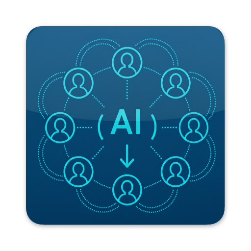
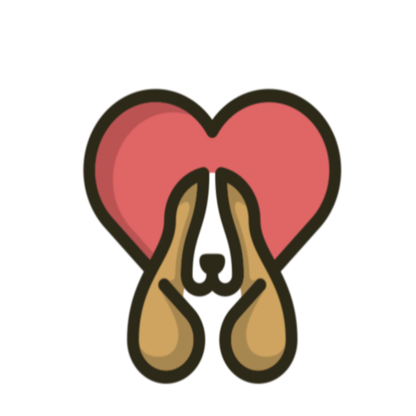
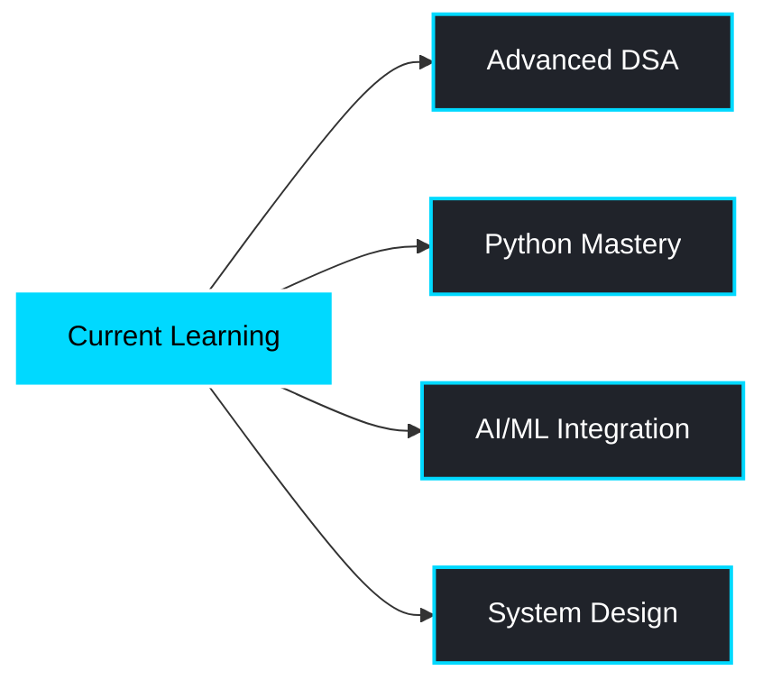

<div align="center">


</div>

<div align="center">
  
[](https://git.io/typing-svg)

</div>

## 👨‍💻 About Me

```javascript
const shubham = {
    role: "React Native Developer",
    location: "Dehradun, India 🇮🇳",
    currentFocus: ["DSA Mastery", "Python", "AI Integration"],
    working_on: "EchoMeet - AI Meeting Summarizer",
    experience: {
        mobile: "3+ production apps deployed",
        problemSolving: "310+ DSA problems solved",
        specialization: "Cross-platform development"
    },
    available_for: [
        "React Native Projects",
        "Full-time Opportunities",
        "Freelance Collaborations",
        "Open Source Contributions"
    ],
    coffee: true // Essential for coding ☕
};
```

<br clear="right"/>

<br clear="right"/>

---

## 🏆 Competitive Programming Achievements

<div align="center">

<table>
<tr>
<td align="center" width="50%">

<br><br>

<br>
<a href="https://www.leetcode.com/shubhmrwt01">

</a>
</td>
<td align="center" width="50%">

<br><br>

<br>
<a href="https://www.codechef.com/users/shubhmrwt01">

</a>
</td>
</tr>
</table>

### 🎯 Total Problems Solved: **310+**


</div>

---

## 🛠️ Tech Stack & Expertise

<div align="center">

### 📱 Mobile Development


### 💻 Programming Languages


### 🎨 Frontend & Styling


### ⚙️ Backend & Database


### 🤖 AI & Tools


</div>

---

## 🚀 Featured Projects

<div align="center">

<table>
<tr>
<td width="50%" valign="top" align="center">

<div align="center">
  
</div>

### 🧠 EchoMeet
**AI-Powered Meeting Summarizer**

Transform conversations into actionable insights using advanced AI agents.

**Tech Stack:**
- React Native & Expo
- Firebase & Clerk Auth
- AI Agent Integration
- Real-time Processing

<a href="https://github.com/shubhmrwt01/EchoMeet">
  
</a>

**Status:** 🚀 Active Development

</td>
<td width="50%" valign="top" align="center">
<br>
<div align="center">

</div>
    
### 🐾 Adoptly
**Pet Adoption Platform**

Connecting abandoned pets with loving families through an intuitive mobile experience.

**Tech Stack:**
- React Native & Expo
- Firebase Backend
- Clerk Authentication
- Adopto AI Chatbot

<a href="https://expo.dev/accounts/shubhmrwt01/projects/Adoptly/builds/a944fb25-33b3-418f-acc8-1360bd999d5b">
  
</a>

**Status:** ✅ Deployed

</td>
</tr>
</table>

</div>

---

## 📊 GitHub Analytics

<div align="center">


</div>

---

## 💼 What I Bring to the Table

<div align="center">

| 🎯 Expertise | 💡 Value |
|-------------|----------|
| **Mobile Development** | 3+ production apps with 5-star ratings |
| **Problem Solving** | 310+ DSA problems conquered |
| **Full-Stack Capability** | End-to-end development experience |
| **AI Integration** | Modern AI-powered features |
| **Clean Code** | Maintainable, scalable architecture |
| **UI/UX Focus** | Pixel-perfect, user-centric design |

</div>

---

## 🌱 Currently Exploring

<div align="center">



</div>

---

## 🤝 Let's Connect & Collaborate!

<div align="center">


**I'm always excited to connect with fellow developers, recruiters, and tech enthusiasts!**

### 📫 Reach Out

[](https://linkedin.com/in/shubhmrwt01)
[](mailto:mail.shubhmrwt01@gmail.com)
[](https://instagram.com/shubhmrwt01)
[](https://www.leetcode.com/shubhmrwt01)
[](https://www.codechef.com/users/shubhmrwt01)

### 💼 Open for Opportunities


---


### ⚡ Fun Facts
🎮 Gaming enthusiast | 👨‍🍳 Amateur chef | ☕ Coffee connoisseur | 🎵 Music lover

<br>

**✨ "Turning caffeine into code, one commit at a time" ✨**

<br>

</div>


