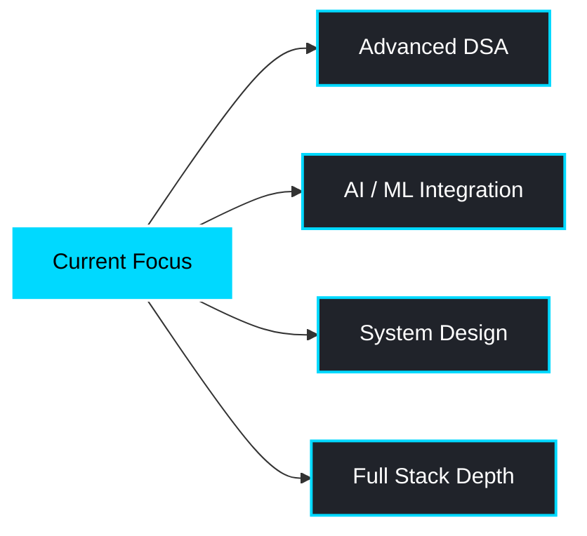

<div align="center">


</div>

<div align="center">

[](https://git.io/typing-svg)

</div>

---

## 👨‍💻 About Me

```javascript
const shubham = {
    role: "React Native Developer & Full Stack Engineer",
    location: "Delhi, India 🇮🇳",
    currentFocus: ["Full Stack App Development", "AI Integration"],
    experience: {
        mobile: "3+ production apps deployed",
        problemSolving: "500+ DSA problems solved",
        specialization: "Cross-platform mobile development"
    },
    available_for: [
        "React Native Projects",
        "Full-time Opportunities",
        "Freelance Collaborations",
        "Open Source Contributions"
    ],
    coffee: true // Essential for coding ☕
};
```

---
## 🏆 Competitive Programming

<div align="center">

###  LeetCode &nbsp;·&nbsp; [`shubhmrwt01`](https://www.leetcode.com/shubhmrwt01)


---

###  CodeChef &nbsp;·&nbsp; [`shubhmrwt01`](https://www.codechef.com/users/shubhmrwt01)


---


&nbsp;

&nbsp;


</div>

---

## 🛠️ Tech Stack

<div align="center">

### 📱 Mobile


### 💻 Languages


### 🎨 Frontend


### ⚙️ Backend & Database


### ☁️ Deployment & DevOps


### 🤖 AI & Design


</div>

---

## 🚀 Featured Projects

<div align="center">

<table>
<tr>
<td width="50%" valign="top">

<h2>🚖 Rydr</h2>

<p>
Real-time ride booking platform with live tracking, instant ride matching, and Socket.IO powered communication.
</p>

<p>


</p>

<p>
<a href="https://github.com/shubhmrwt01/Rydr">

</a>

<a href="https://rydr-o2d5.onrender.com">

</a>

<a href="https://drive.google.com/file/d/14P-OH9MuqbkLPGDahSqZmY1djH_RAbPd/view?usp=drivesdk">

</a>
</p>


</td>

<td width="50%" valign="top">

<h2>🐾 Adoptly</h2>

<p>
AI-powered pet adoption platform connecting abandoned pets with loving families through a modern mobile experience.
</p>

<p>


</p>
<br/>

<p>
<a href="https://github.com/shubhmrwt01/Adoptly">

</a>

<a href="https://drive.google.com/file/d/1NRpjEclp27CAJOwRgCdFfsJobySbidEr/view">

</a>
</p>


</td>
</tr>
</table>

</div>

---

## 💼 What I Bring

<div align="center">

| 🎯 Expertise | 💡 Value |
|---|---|
| **Mobile Development** | 3+ production apps shipped end-to-end |
| **Full-Stack** | REST APIs, real-time sockets, cloud deployment |
| **Problem Solving** | 500+ DSA problems across LeetCode & CodeChef |
| **AI Integration** | Modern AI-powered features in production apps |
| **Clean Code** | Modular, maintainable, scalable architecture |
| **UI/UX Focus** | Pixel-perfect, user-centric mobile interfaces |

</div>

---

## 🌱 Currently Exploring

<div align="center">


```mermaid
graph LR
    A[Current Focus] --> B[Advanced DSA]
    A --> C[AI / ML Integration]
    A --> D[System Design]
    A --> E[Full Stack Depth]

    style A fill:#00D9FF,stroke:#fff,stroke-width:2px,color:#000
    style B fill:#20232A,stroke:#00D9FF,stroke-width:2px,color:#fff
    style C fill:#20232A,stroke:#00D9FF,stroke-width:2px,color:#fff
    style D fill:#20232A,stroke:#00D9FF,stroke-width:2px,color:#fff
    style E fill:#20232A,stroke:#00D9FF,stroke-width:2px,color:#fff
```

</div>

---

## 🤝 Let's Connect

<div align="center">

[](https://linkedin.com/in/shubhmrwt01)
[](mailto:mail.shubhmrwt01@gmail.com)
[](https://instagram.com/shubhmrwt01)
[](https://www.leetcode.com/shubhmrwt01)
[](https://www.codechef.com/users/shubhmrwt01)

<br/>


<br/>


<br/><br/>

**✨ "Turning caffeine into code, one commit at a time" ✨**

</div>


